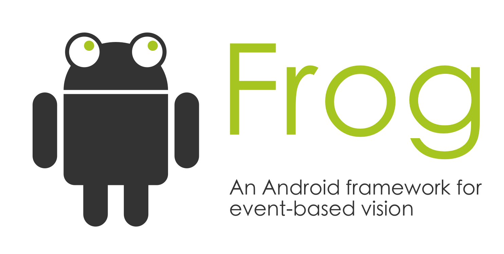

# Frog
Frog is an Android app which lets you use an event-camera that is connected via USB to the phone. You can then parse the events with your own C++ code or use the [Tarsier](https://github.com/neuromorphic-paris/tarsier) toolbox. 

# Installation
It's easiest to use [Android Studio](https://developer.android.com/studio/index.html), for superb support of both Java and C++ code and the Gradle build tool. Alternatively, run `gradlew clean build` from the command line and install the .apk file under app/build/outputs/apk/release/ manually.

# Test
Java code is backed up by [Robolectric](http://robolectric.org/). This does not include any C++ code for the moment. 

Master Branch build status: 

# Contribute
Simply open up a pull request from your fork. This repo will stay free of actual C++ algorithms for the moment. 

# License
See the [LICENSE](LICENSE.txt) file for license rights and limitations (GNU GPLv3).
